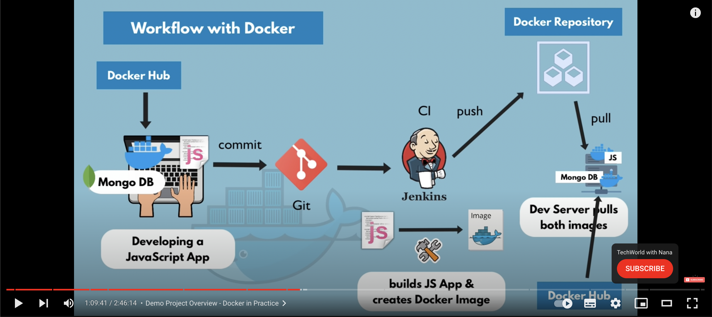

# Day - 1: Docker - https://youtu.be/3c-iBn73dDE

## Overview

1. What is docker? What is a Container?

2. Docker vs. Virtual Machine

3. Docker installation

4. Main commands

5. Debugging a Container

6. Developing with Containers

7. Docker Compose - Running multiple services

8. Dockerfile - Building own Docker image

9. Private Docker Repository (AWS)

10. Deploying the containerized App

11. Volumes - Persiting Data

12. Volumes demo

## 1. What is Container

### What

- package, necessary dependencies and configuration
- portable artifact, shared and moved
- develop and deploy, more efficient

- Container is made of **images** (linux image layer, ..., application image layer)

### Where

- Container repository (https://hub.docker.com/)  

### How it helps

- Before containers: 
  New projects -> install serivices (PostgresSQL, Redis, Node, ...) -> Many steps, version, OS

- After containers:
  New projects -> install isolated environment, packaged with all needed configuration -> one command for one service

### Note

- Different between container and image
- CONTAINER Port vs HOST port

### Basic commands

- `docker pull` (version tag) 
- `docker run` (-d, :version, -p)
- `docker start`
- `docker stop`
- `docker ps` (-a)
- `docker exec -it` (/bin/bash) (ls, cd, pwd, env, exit)
- `docker logs`

## 2. Demo project overview

- [source ref](https://gitlab.com/nanuchi/techworld-js-docker-demo-app)

### Run container

### Using dockerfile to build docker image

Note:

- Docker network connect two containers (if their in the same network)

- Restart container -> data is gone (**using volumes for data persistence**)

- Using docker-compose file to structure command when using docker to run container (also it **auto did the network stuff** for you)

- Adjust dockerfile -> rebuild the image

Command:

- `docker-compose up -d`
- `docker rm`
- `docker rmi`
- `docker build` (-t)

# Day - 3

## Docker registry

- Docker private repository (on AWS ECR, AWS CLI, Credential configure)

- Registry options

- Image naming in docker registries (registryDomain/imageName:tag)

Command:

- `docker images`
- `docker login`
- `docker push`/

## Deploy

- Add my-app image (project image) on the docker-compose file

- change the MongoCLient.connect url to mongodb

## Persisting Data with Volumes

- should use **Named Volume** volumes when working with product

- change from container affect host and vice versa (speicific file is configured in docker-compose `volumes` or `-v` if using CLI)